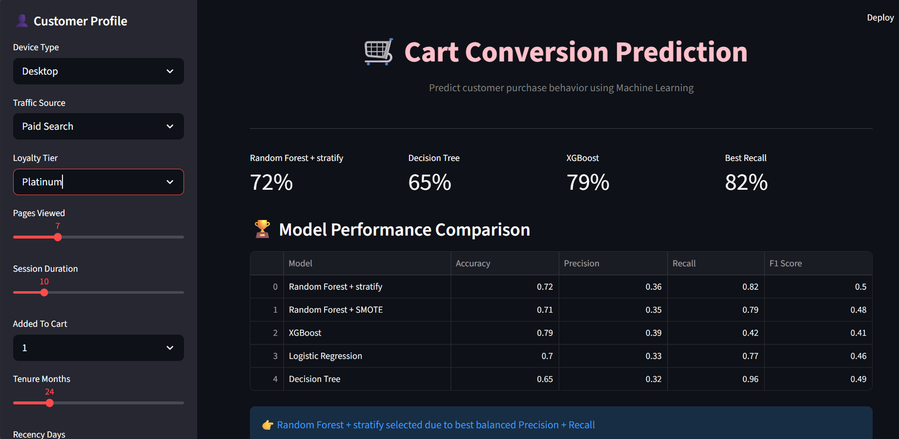
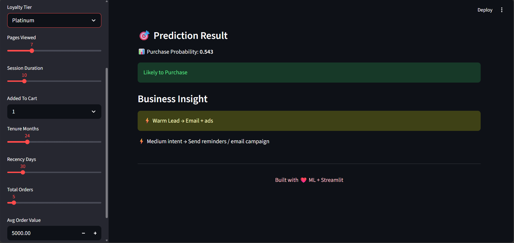
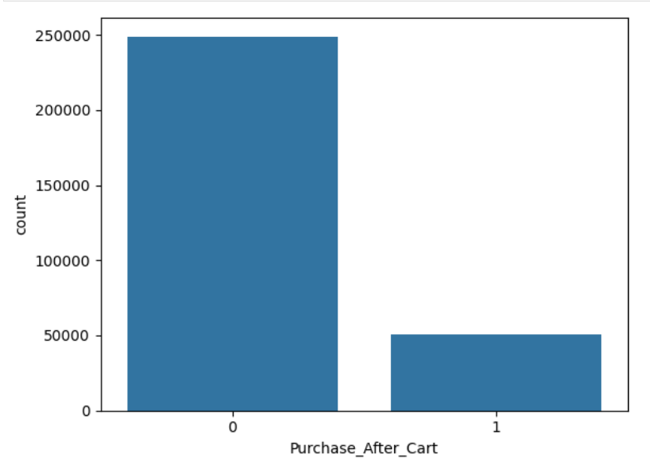
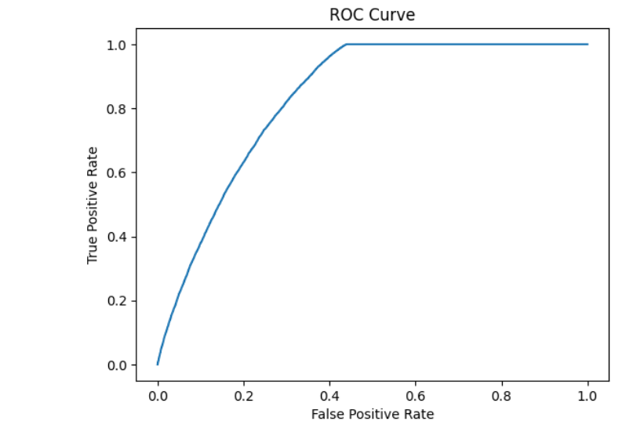
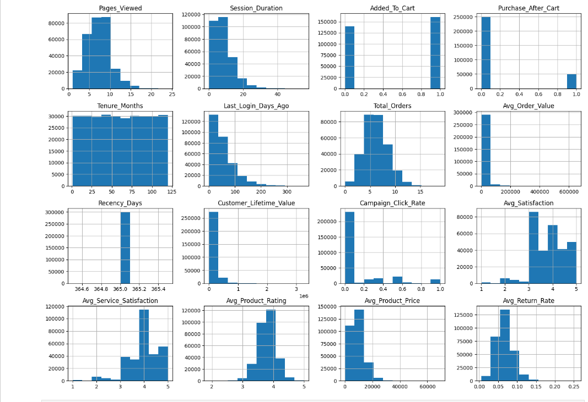
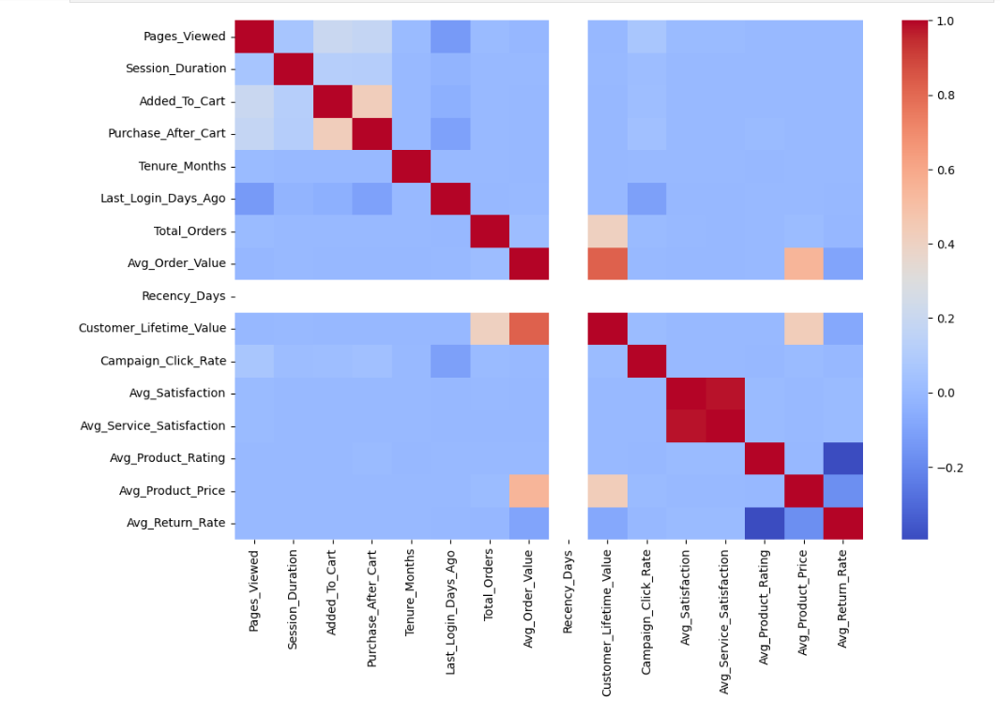
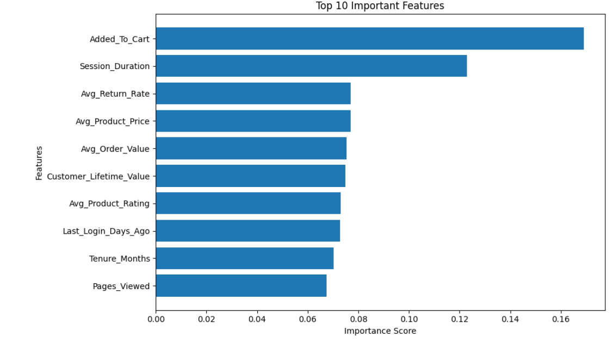

# 🛒 E-Commerce-Cart-Conversion-Prediction
An end-to-end Machine Learning project that predicts whether a customer will complete a purchase after adding products to their shopping cart. The project combines customer behavior, website activity, product information, order history, and customer service data to help e-commerce businesses reduce cart abandonment and improve conversion rates.

## Project Overview

Cart abandonment is one of the biggest challenges faced by e-commerce businesses, resulting in significant revenue loss. This project develops a predictive machine learning model to identify customers who are likely to abandon their carts before completing a purchase.

The solution enables businesses to take proactive actions such as personalized offers, reminder emails, and targeted marketing campaigns to increase conversion rates and recover lost revenue.


## Business Problem

ShopSphere, a large e-commerce retailer, observed that a high percentage of customers add products to their shopping carts but leave the website without completing their purchases.

This behavior results in:

- Revenue loss
- Low conversion rates
- Inefficient marketing campaigns
- Poor customer engagement

The company requires a predictive analytics solution capable of identifying customers who are likely to abandon their carts so that timely interventions can be applied.

## Dashboard Preview
### Streamlit Dashboard
<p>
  
</p>


## Solution
A Machine Learning Cart Conversion Prediction System was developed to predict whether a customer will complete a purchase after adding products to the cart.

### Target Variable

- **0 → Cart Abandonment**
- **1 → Purchase Completion**

The model analyzes customer behavior, website interactions, purchase history, product information, and satisfaction metrics to estimate purchase probability.

### Streamlit Dashboard
<p>
  
</p>


## Project Structure

```
Cart-Conversion-Prediction/
│
├── Datasets/
│   ├── Website_Activity.csv
│   ├── Customer_Department_Targets.csv
│   ├── Products.csv
│   ├── Orders.csv
│   └── Customer_Service.csv
│
├── notebooks/
│   └── E_Commerce_Cart_Conversion_Prediction.ipynb
│
├── models/
│   └── cart_conversion_model.pkl
│
├── Streamlit_Dashboard/
│   └── app.py
│
├── Images/
│   ├── Dashboard1.png
│   ├── Important_Features
│   ├── Roc_Curve
│   ├── Hist_Plot
│   ├── Heatmap
│   ├── Target_Distribution
│   └── Dashboard_2.png
│
├── Requirements.txt
│
└── README.md
```

## 📊 Exploratory Data Analysis & Visualizations
The following visualizations provide insights into customer behavior, purchase patterns, and the key factors influencing cart conversion.


##  1. Target Distribution
<p>
  
</p>

- This chart shows the distribution of the target variable **Purchase_After_Cart**.

- **0 → Cart Abandonment**
- **1 → Purchase Completion**

### Key Insight

- Approximately **83%** of customers abandoned their carts.
- Only **17%** completed their purchase.

This severe class imbalance justified the use of **SMOTE** during model training.


##  2. ROC Curve
<p>
  
</p>

- The ROC Curve evaluates the model's ability to distinguish between customers who will purchase and those who will abandon their carts.

### Key Insight

- A curve closer to the top-left corner indicates better model performance.
- ROC-AUC provides a threshold-independent measure of classification quality.
- Higher AUC values indicate stronger predictive capability.


##  3. Feature Distribution
<p>
  
</p>

- Histograms display the distribution of important numerical features such as:

- Pages Viewed
- Session Duration
- Customer Lifetime Value
- Average Order Value
- Product Rating

### Key Insight

The distributions reveal customer browsing and purchasing patterns, helping identify skewed variables and understand customer engagement before model training.


##  4. Correlation Heatmap
<p>
  
</p>

- The heatmap illustrates the correlation between numerical features in the dataset.

### Key Insight

- Strong positive relationships indicate features that increase purchase probability.
- Weakly correlated variables provide unique information to the model.
- The heatmap also helps identify multicollinearity among features.


##  5. Feature Importance
<p>
  
</p>

- Feature importance identifies the variables that contribute most to predicting purchase completion.

### Top Influential Features

- Added_To_Cart
- Session_Duration
- Avg_Return_Rate
- Avg_Product_Price
- Avg_Order_Value
- Customer_Lifetime_Value
- Pages_Viewed

### Key Insight

Customer engagement, shopping behavior, and product-related attributes have the strongest influence on conversion.


## Objectives

- Predict customer purchase completion.
- Identify customers at risk of cart abandonment.
- Improve marketing effectiveness.
- Increase conversion rate.
- Recover lost revenue.
- Support business decision-making using predictive analytics.


## Dataset Information

The project uses multiple datasets representing different business domains.

| Dataset | Description |
|----------|-------------|
| Website Activity | Customer browsing behavior and session information |
| Customer Department Targets | Customer demographics and loyalty information |
| Orders | Historical order information |
| Products | Product details, ratings, pricing and return rate |
| Customer Service | Customer satisfaction and service interactions |

Total Records:

- **300,000+ customer sessions**


## Data Preprocessing

The following preprocessing steps were performed:

- Removed unnecessary columns
- Handled missing values
- Aggregated customer service metrics
- Aggregated product information
- Merged multiple datasets
- One-Hot Encoding
- Feature Engineering
- Class imbalance handling using SMOTE
- Train-Test Split using Stratified Sampling

## Feature Engineering

Engineered features include:

- Avg_Service_Satisfaction
- Avg_Product_Rating
- Avg_Product_Price
- Avg_Return_Rate
- Customer_Lifetime_Value
- Campaign_Click_Rate
- Avg_Order_Value
- Total_Orders
- Recency_Days


## Machine Learning Models

The following models were trained and evaluated:
- Random Forest + Stratify
- Random Forest + Smote
- Logistic Regression
- Decision Tree
- XGBoost


## Model Evaluation

Evaluation metrics used:

- Accuracy
- Precision
- Recall
- F1 Score
- ROC-AUC Score
- Confusion Matrix

## Exploratory Data Analysis

Key analyses performed:

- Cart Abandonment Distribution
- Device Type Analysis
- Traffic Source Analysis
- Loyalty Tier Analysis
- Customer Lifetime Value Analysis
- Product Rating Analysis
- Session Duration Analysis
- Pages Viewed Analysis
- Feature Importance


## Business Insights

Key findings include:

- Most customers abandon their carts before checkout.
- Session duration positively influences purchase completion.
- Customers with higher loyalty tiers have better conversion rates.
- Customer Lifetime Value is strongly associated with purchase probability.
- Marketing engagement significantly impacts conversion.
- Product ratings and pricing influence customer purchase decisions.


## Business Impact

The developed solution enables the company to:

- Predict customers likely to abandon their carts.
- Launch personalized remarketing campaigns.
- Send targeted discount offers.
- Recover lost revenue.
- Improve marketing ROI.
- Increase checkout completion rate.
- Enhance customer experience.


## Technology Used

### Programming

- Python

### Libraries

- Pandas
- NumPy
- Scikit-learn
- Imbalanced-learn (SMOTE)
- Matplotlib
- Seaborn
- Joblib

### Visualization

- Matplotlib
- Seaborn
- Streamlit


## Installation


Install dependencies

```bash
pip install -r requirements.txt
```

Run the Streamlit application

```bash
streamlit run app.py
```

## Future Enhancements

- Deep Learning Model
- Real-Time Prediction API
- Customer Segmentation
- Recommendation System Integration
- Automated Marketing Campaign Trigger
- Cloud Deployment (AWS/Azure)


## Author
**Prajakta Bhondave**
- Aspiring Data Analyst | Python | SQL | Power BI | Machine Learning | Streamlit

LinkedIn: https://www.linkedin.com/in/prajakta-bhondave-773b092a6/

GitHub: https://github.com/prajakta-89
